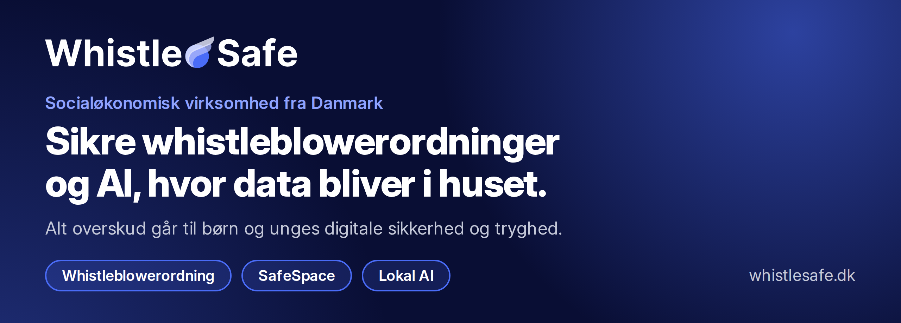

  <a href="https://whistlesafe.dk"><b>whistlesafe.dk</b></a>
  &nbsp;·&nbsp;
  <a href="https://app.whistlesafe.dk/pricing">Prøv 30 dage gratis</a>
  &nbsp;·&nbsp;
  <a href="mailto:kontakt@whistlesafe.dk">kontakt@whistlesafe.dk</a>
  &nbsp;·&nbsp;
  +45 31 70 77 73

## Hej, vi er WhistleSafe

WhistleSafe ApS er en dansk, socialøkonomisk virksomhed. Vi laver sikre indberetnings- og
whistleblowerløsninger og privatlivsvenlig AI til virksomheder, skoler, foreninger og fagfolk med
tavshedspligt — og alt overskud går til at sikre børn og unges digitale sikkerhed og tryghed.

## Det laver vi

### [WhistleSafe whistleblowerordning](https://whistlesafe.dk)

Siden 17. december 2023 skal alle private virksomheder med 50 eller flere ansatte have en intern
whistleblowerordning. WhistleSafe er en komplet platform, som er sat op på under 5 minutter:

- Anonym indberetning fra mobil, tablet og computer — uden konto og uden app
- Anonym dialog med whistlebloweren via en personlig sags-ID
- Sagsstyring med sagsbehandlere, prioritet, interne noter og afdelinger
- EU-direktivets frister indbygget: kvittering inden 7 dage og tilbagemelding inden 3 måneder
- Hele sagsmapper til revisor og jurist som PDF og ZIP, alle sager som CSV
- Brugerflade på 8 sprog

**Fra 249 kr./md. ekskl. moms · 30 dage gratis · ingen binding**

### [SafeSpace](https://whistlesafe.dk/safespace) — til skoler

Et trygt sted, hvor elever kan indberette det, de ikke selv kan håndtere — fx digital mobning,
krænkelser, sextortion eller ulovlig billeddeling — også anonymt. Skolen får indblik i det mørketal,
voksne ellers ikke ser. SafeSpace kører på samme platform som whistleblowerordningen.

**349 kr./md. ekskl. moms · ingen binding**

### [Lokal AI](https://whistlesafe.dk/lokalai) — til fagfolk med tavshedspligt

En færdigkonfigureret AI-computer, hvor sprogmodellerne kører 100 % lokalt, så patient- og
klientdata aldrig forlader maskinen. Til psykologer, sundhedsfaglige, advokater, revisorer og andre,
der arbejder med følsomme oplysninger. Vi leverer maskine, software og modeller klar til brug og
hjælper jer i gang.

**Køb fra 15.000 kr. · leasing fra 995 kr./md. · ekskl. moms**

## Sådan passer vi på data

- Hostet i EU på Microsoft Azure (North Europe) med ISO/IEC 27001-certificeret infrastruktur
- Data krypteres under transport og i hvile
- Whistlebloweres identitet knyttes ikke til nogen brugerkonto — adgang sker via virksomhedens
  anonyme link og sags-ID
- To-faktor-login, rate-limiting og kontolåsning på manager-konti
- Alle underdatabehandlere behandler data i EU/EØS — [se listen (PDF)](https://api.whistlesafe.dk/api/Public/sub-processors)
- Databehandleraftalen genereres og accepteres direkte i appen

## Holdet

- **Christian Nedergaard Staal** ([@cstaal](https://github.com/cstaal)) — IT-civilingeniør med
  speciale i netværk og sikkerhed, 20 års erfaring med IT-drift og .NET-udvikling
- **David Troutman Madsen** — autoriseret psykolog, stifter af Psykolog- og Lægehuset Dabeco og
  tilknyttet Medierådet
- **Paw Ormstrup Madsen** ([@PawOrmstrupMadsen](https://github.com/PawOrmstrupMadsen)) — Principal
  Software Engineer, driver udviklingen af platformen

## Om koden

Platformen er bygget på .NET, ASP.NET Core og Blazor WebAssembly og kører på Azure. Vores
repositories er private, så der er ikke meget at kigge i her — men vi hører gerne fra andre udviklere.

Har du fundet en sikkerhedsfejl i en af vores tjenester, så skriv til
[kontakt@whistlesafe.dk](mailto:kontakt@whistlesafe.dk).

<b>In English</b>

 

WhistleSafe ApS is a Danish social enterprise: all profit goes to the digital safety and wellbeing of
children and young people. We build:

- **WhistleSafe** — a complete internal whistleblowing system for organisations covered by the EU
  Whistleblower Directive (2019/1937): anonymous reporting without accounts, case management, the
  7-day and 3-month deadlines built in, case exports for auditors and lawyers, and a UI in 8
  languages. Hosted in the EU on Microsoft Azure.
- **SafeSpace** — a reporting channel for pupils and students at schools.
- **Lokal AI** — ready-to-use AI computers where the language models run 100% on-premises, for
  professionals bound by confidentiality.

Website (Danish): [whistlesafe.dk](https://whistlesafe.dk) · Contact:
[kontakt@whistlesafe.dk](mailto:kontakt@whistlesafe.dk)

---

WhistleSafe ApS · CVR 44 41 26 67 · Ndr Dragørvej 151, 2791 Dragør · <a href="https://whistlesafe.dk">whistlesafe.dk</a>
